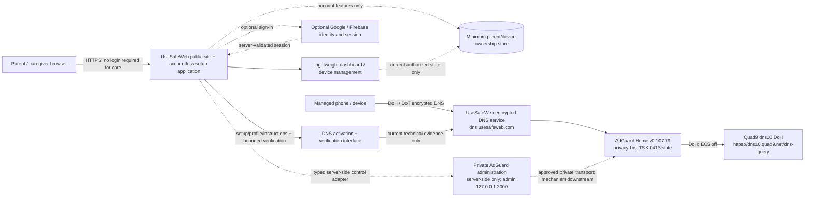
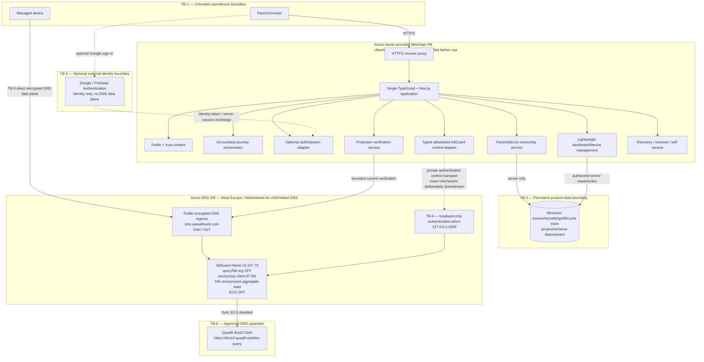
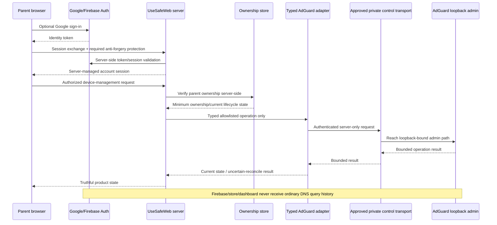

# TSK-0235 — System Context, Container, and Integration Diagrams

**Version:** 1.0.0  
**Date:** 2026-09-01  
**Lifecycle:** L5 — Architecture, Technical Design & Delivery Readiness  
**Task:** TSK-0235 — Create system context, container, and integration diagrams  
**Acceptance:** ACC-0235 / VER-0235 / EVD-0235  
**Authority:** current WBS + DEC-0053/CR-0006 + DEC-0054/CR-0007 + DEC-0055/CR-0008  
**Dependency:** TSK-0043 current PASS; current LG-06 PASS  
**Primary architecture source:** `TSK_0354_VERSION_1_APPLICATION_ARCHITECTURE_2026-09-01.md`  
**DNS/privacy source:** `infrastructure/adguard-server/tsk-0413-bundle-v1/README.md` and the versioned TSK-0413 bundle  

## 1. Purpose and frozen interpretation

These diagrams document the already accepted Version-1 architecture; they do not invent implementation scope or claim deployment. The complete accountless setup/protection journey remains usable without login. Optional Google/Firebase identity/session exists only for the bounded parent account, minimum parent/device ownership persistence, and lightweight dashboard/device-management capability.

The diagrams carry the approved TSK-0413 privacy-first AdGuard desired state as a hard invariant:

- AdGuard Home `v0.107.79`, schema `34`;
- upstream exactly `https://dns10.quad9.net/dns-query`;
- ECS: **OFF**;
- persistent query logging and query file logging: **OFF**;
- exceptional query diagnostics are not a default path, require separate authority, are capped at 24 hours, and are deleted after use;
- minimum anonymized aggregate operational statistics: **ON with 24-hour retention**;
- identifiable per-client statistics/history: **excluded**;
- client-IP anonymization: **ON**;
- initial active filter: official AdGuard DNS filter only; versioned allowlist starts empty;
- AdGuard administration is authenticated, private, and loopback-bound at `127.0.0.1:3000`; there is no public arbitrary `/control/*` proxy;
- browser code never receives AdGuard administrative credentials, Firebase Admin credentials, datastore credentials, TLS private keys, or recovery secrets;
- no browsing/query/activity history path exists in the product, dashboard, account store, analytics, or support data;
- parent/device ownership never creates a technical `Verified` protection state.

## 2. System context



### Context rules

1. **Accountless core:** the parent can reach setup, configure DNS, verify current protection, understand the Protection Map, troubleshoot, recover, remove, and reconfigure without authentication.
2. **Optional account plane:** Google/Firebase identity/session and the ownership store are used only when the parent chooses persistence/dashboard value.
3. **DNS plane isolation:** ordinary DNS queries never traverse Firebase/Google, the ownership store, dashboard, CMS, product analytics, or the Next.js application.
4. **Truth state:** account presence, device ownership, a saved ClientID, or parent confirmation is never sufficient to produce technical `Verified`; verification uses current DNS evidence.
5. **AdGuard control:** browser calls only UseSafeWeb application operations. AdGuard administrative credentials and raw unrestricted control endpoints stay private/server-side.

## 3. Container/deployment and trust-boundary view



### Trust-boundary obligations

| Boundary | Allowed data/operation | Explicitly forbidden |
|---|---|---|
| TB-1 Browser/device → app | public content, accountless journey state, optional identity token, authorized product requests | AdGuard admin credential, Firebase Admin credential, datastore secret, TLS key, raw recovery secret, trusted ownership/verification claims from browser |
| TB-2 Optional identity | minimum identity/auth/session exchange for optional account | DNS queries, browsing history, mandatory login for core value |
| TB-3 Ownership store | minimum parent identity reference, opaque device ownership/settings/lifecycle metadata | visited domains, query history, child activity history, raw DNS logs, using ClientID as authorization |
| TB-4 Private AdGuard control | typed allowlisted server-side operations after authorization; authenticated admin reachable only through approved private mechanism | public `/control/*`, browser passthrough, arbitrary admin API, secret exposure |
| TB-5 DNS data plane | device DNS over approved encrypted endpoint; current bounded verification | routing ordinary DNS through app/account/auth/analytics; using account state as DNS proof |
| TB-6 Quad9 | AdGuard → exact dns10 DoH upstream with ECS disabled | dns11/dns12 or another ECS endpoint without explicit authority |

## 4. Integration flows

### 4.1 Accountless activation and technical verification

```mermaid
sequenceDiagram
    participant B as Parent browser
    participant A as UseSafeWeb Next.js app
    participant D as Managed device
    participant E as dns.usesafeweb.com encrypted endpoint
    participant G as AdGuard Home v0.107.79
    participant Q as Quad9 dns10 DoH

    B->>A: Start accountless setup
    A-->>B: Platform-specific setup/profile/instructions
    B->>D: Apply supported DNS configuration
    D->>E: Encrypted DNS query (DoH/DoT)
    E->>G: Protected same-host DNS ingress
    G->>Q: DoH upstream, ECS off
    Q-->>G: DNS response
    G-->>E: Filtered DNS response
    E-->>D: DNS response
    A->>E: Bounded current verification request
    E-->>A: Current technical verification result only
    A-->>B: Truthful Protection Map state
    Note over B,Q: No login required; no browsing/query/activity history stored by product flow
```

### 4.2 Optional account/dashboard and private control



The concrete private-control transport is intentionally **not selected by TSK-0235**. Downstream design/implementation must choose the smallest auditable mechanism that can reach the DNS VM while preserving the TSK-0413 loopback-only admin baseline, authentication, secret isolation, and no-public-`/control` rule. If no safe mechanism satisfies those constraints, the relevant downstream task must fail closed and reopen the integration design rather than exposing AdGuard administration.

## 5. Regions and processing boundaries

- **Azure hosting baseline:** the owner manually supplies two reachable fresh Ubuntu 24.04 LTS VMs; project automation begins after handoff. TSK-0235 does not create or configure Azure control-plane resources.
- **DNS child-linked path:** Experiment-1 child-linked DNS is constrained to **Azure West Europe / Netherlands**; no US DNS node is part of that path.
- **Web/app VM:** remains separate from the DNS VM. Its actual deployment region must be verified against current privacy/hosting authority before use; this diagram does not invent an unapproved region.
- **DNS upstream:** only AdGuard sends ordinary DNS upstream traffic to Quad9 dns10. ECS stays off.
- **Identity provider:** Google/Firebase participates only in the optional identity/session flow. It is not a DNS processor in the accountless or authenticated data plane.
- **Ownership store:** purpose-limited to the optional persistent account/device feature; it does not receive domain/query/activity history.

## 6. Explicitly excluded processors, paths, and expansions

The architecture has **no** path for any of the following:

- Firebase/Google processing ordinary DNS queries or browsing/domain history;
- the ownership store, dashboard, CMS, analytics, support, Stripe/PayPal, or any marketing processor receiving DNS query/domain history;
- a public AdGuard administration interface or arbitrary `/control/*` proxy;
- AdGuard admin credentials, TLS private keys, datastore credentials, or Firebase Admin credentials reaching browser code;
- child accounts/profiles, unrestricted customer DNS administration, raw policy editing, or a browsing/activity dashboard;
- mandatory login for the core setup/protection value;
- account/device ownership, ClientID presence, or parent confirmation being treated as technical `Verified` protection;
- third-party filter-list expansion beyond the current TSK-0413 official initial AdGuard DNS filter and separately governed versioned exceptions;
- hidden restoration of identifiable query logs/history through backup, recovery, analytics, or support tooling.

## 7. ACC-0235 verification trace

| ACC-0235 element | Diagram/evidence location | Result |
|---|---|---|
| Public site | System context + Web/App container | PASS |
| Accountless setup application | System context, Web/App container, accountless sequence | PASS |
| Optional Google/Firebase identity/session | Context, TB-2, optional-account sequence | PASS |
| Minimum parent/device ownership store | Context, TB-3, optional-account sequence | PASS |
| Lightweight dashboard/device management | Context + Web/App container | PASS |
| DNS activation/verification interfaces | Context + accountless sequence | PASS |
| Private AdGuard administration path | Context, TB-4, optional-account sequence; exact transport intentionally downstream | PASS |
| Direct encrypted DNS data plane | Context, TB-5, accountless sequence | PASS |
| Quad9 | Exact dns10 DoH endpoint shown; ECS off | PASS |
| Regions | Azure owner-provided two-VM boundary; West Europe/Netherlands child-linked DNS | PASS |
| Trust boundaries | TB-1 through TB-6 | PASS |
| Excluded processors | Section 6 and region/processing boundaries | PASS |
| Browser never receives AdGuard admin credentials | Frozen invariants, TB-1/TB-4, exclusions | PASS |
| No browsing/activity history path | Frozen invariants, trust table, both flows, exclusions | PASS |

## 8. Source reconciliation and deviations

- `TSK-0354` supplies the accepted one-application/two-VM architecture, accountless-first + optional-account split, server-only AdGuard adapter, separate DNS data plane, minimum data domains, and truth-state rules.
- TSK-0413 bundle v1.0.0 supplies the exact AdGuard/privacy desired state and public service identity used here.
- `REQ-0049`, `REQ-0050`, `CON-0004`, and `CON-0005` preserve Azure VM handoff/separation, West Europe child-linked DNS, lean topology and recovery boundary.
- TSK-0235 intentionally does **not** select the persistent datastore product/schema, exact Firebase dependency/configuration, or the concrete cross-VM private AdGuard-control transport; those are downstream contracts. This is not an ACC-0235 gap because the required logical boundaries and safe path constraints are explicit.
- No implementation, deployment, LG-07/LG-08, production activation, launch, or real-user validation PASS is inferred from these diagrams.
