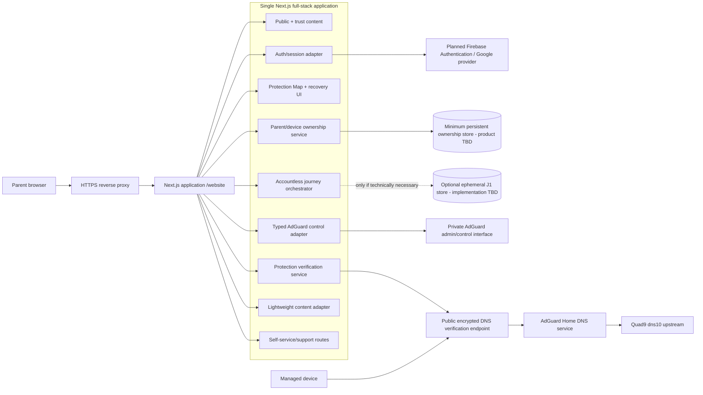

# TSK-0354 — Version-1 Application Architecture and Data Boundary

**Version:** 1.0.0  
**Date:** 2026-09-01  
**Lifecycle:** L5 — Architecture, Technical Design & Delivery Readiness  
**Task:** TSK-0354 — Design the Version-1 accountless-core plus optional-account application architecture and data boundary  
**Acceptance:** ACC-0354 / VER-0354 / EVD-0354  
**Authority:** DEC-0053 / CR-0006; DEC-0054 / CR-0007; DEC-0055 / CR-0008  
**Status represented:** PASS CANDIDATE pending canonical GitHub read-back and current-contract acceptance; no implementation, LG-07, LG-08, production deployment, public launch, or real-user evidence is inferred.

## 1. Decision

Use **one production-capable TypeScript + Next.js full-stack application under `/website`** for the public website, complete accountless safety-setup journey, optional parent authentication/session path, lightweight dashboard/device-management experience, Protection Map presentation, troubleshooting/recovery UI, and the server-side application boundary to AdGuard.

Keep the system deliberately small:

- one web/application deployable on the owner-provided web VM;
- one separate AdGuard/DNS service on the owner-provided DNS VM;
- no microservices, service mesh, Kubernetes, dedicated queue/broker, public integration API, native application, child account, school portal, data warehouse, heavy CMS, or multi-region active-active architecture;
- provider/datastore details are introduced only where the already-approved Version-1 capability genuinely requires them.

**Accountless core remains fully usable without login.** Optional account availability may add persistence and bounded device management, but authentication/provider/datastore failure must never turn core safety value into a mandatory-login journey.

## 2. Inputs and frozen boundaries

This architecture consumes, without reopening:

- `TSK-0146` Version-1 product baseline: Phone → Internet → Services → truthful Protection Map → recovery; complete accountless core plus optional parent account/lightweight dashboard/device management.
- `TSK-0229` accountless data contract and post-CR-0006 amendment: J0 preferred browser/session state; J1 optional anonymous short-lived server state only if necessary; hard non-sliding TTL ≤24h; no automatic J1-to-account linkage; anonymous deletion independent of account/device/DNS deletion.
- `TSK-0309` implementation-ready dual-mode experience baseline.
- `REQ-0036`: one TypeScript + Next.js full-stack application under `/website`.
- `REQ-0037`: minimum short-lived accountless state; persistent account/device state limited to approved ownership/settings/lifecycle purposes; no browsing/query/activity history.
- `REQ-0038`: store only necessary state; avoid an unnecessary application database/ledger.
- `CON-0010`: optional account and lightweight dashboard are Version-1 scope; core remains accountless-capable.
- `CON-0011`: core value remains free with no card/trial before value.
- `CON-0027`: no child account, broad DNS admin, native app, school portal, public integration platform, heavy infrastructure or other excluded expansion.
- `INT-0011`: one deployable application release candidate.
- `INT-0012`: application-to-DNS integration must expose no admin credentials and must report only evidence-backed DNS state.
- `RSK-0045`: prevent account/dashboard scope from becoming mandatory, surveillant or operationally complex.

No `/website` implementation exists at this decision point, so there is no repository dependency file from which to detect an exact Next.js/React/Firebase version. **TSK-0354 therefore does not invent dependency versions.** Exact dependency/runtime pinning belongs to downstream implementation/ADR work and must be checked against then-current official documentation.

## 3. Production architecture

### 3.1 Runtime shape

The web/app VM runs the self-hosted Next.js application behind a reverse proxy. Current Next.js self-hosting guidance recommends placing a reverse proxy such as nginx in front of the Next.js server to absorb malformed/slow requests, payload limits and rate-limit concerns rather than exposing the application server directly.

The architecture uses the current **App Router** model. Server Components are the default for server-rendered/read paths; Client Components are limited to UI requiring browser state, event handling or browser APIs. Route Handlers provide explicit HTTP boundaries for session exchange, state mutation, verification, device-management and other server endpoints. This avoids creating a second application API service solely for architectural layering.

### 3.2 One application, explicit internal modules

The single deployable remains internally modular so security and data boundaries are testable without becoming separate services:

| Module | Responsibility | May hold secrets? | Persistent user data? |
|---|---|---:|---:|
| Public/content | discover, understand, trust, decide, start | No | No |
| Journey orchestrator | Phone → Internet → Services → Protection Map routing | No | J0; optional J1 only under TSK-0229 |
| Auth/session adapter | establish/verify/revoke optional parent session | Server only | Provider/session identifiers only as downstream-approved |
| Ownership service | parent-to-device authorization and bounded lifecycle/settings | Server only | Minimum approved parent/device ownership domain |
| Protection verification | technical status checks and truth-state mapping | Server-only configuration where required | Controlled current status only; no history |
| AdGuard control adapter | allowlisted server-side control operations | **Yes, server only** | No browsing/query history |
| Content adapter | approved versioned product/device/service content | No | Content only |
| Support/recovery | self-service diagnosis/removal/reinstall/recovery | Server-only configuration where required | Minimum controlled support state only |

A lightweight browser-editable CMS may feed the content adapter if later selected, but it is a content source only. It must not become the account datastore, secret store, telemetry store or product-state authority.

## 4. Trust boundaries

### TB-1 — Browser ↔ public web/application

Everything from the browser is untrusted input. The browser may hold J0 presentation/journey state and the minimum public configuration needed by approved client SDKs, but it never receives application administration secrets, Firebase Admin credentials, AdGuard admin credentials, datastore credentials or protected recovery material.

State-changing account/device/AdGuard operations require server-side authorization and validation. Browser-supplied device IDs, ClientIDs, ownership claims or Protection Map states are requests/claims, not authority or technical verification.

### TB-2 — Browser auth flow ↔ server session boundary

The planned Google/Firebase path may obtain an identity token in the browser and send it to a dedicated server endpoint. The server validates/exchanges it using the approved Firebase Admin/session mechanism before setting the server-managed session cookie. Account data is served only after server-side session verification.

This is a boundary, not final Firebase vendor approval: exact provider configuration, quotas/pricing/terms, cookie duration, revocation policy and migration trigger remain `TSK-0356` / downstream security acceptance.

### TB-3 — Next.js server ↔ persistent ownership store

Only server-side code accesses the persistent ownership store. Every device operation is scoped by the authenticated parent identity and server-side ownership check. An opaque device identifier or AdGuard ClientID is never authorization by itself.

The concrete datastore product and exact schema are deliberately **not selected here**. They are owned by `TSK-0233 / TSK-0355` and must be selected only after current privacy/security/vendor/reliability evidence. TSK-0354 fixes the boundary and failure semantics, not an unsupported vendor assumption.

### TB-4 — Next.js server ↔ private AdGuard control plane

AdGuard administrative access exists only on the server side over the approved private/restricted network path. No generic browser-accessible proxy to `/control/*` is allowed. The application exposes only its own narrow typed operations after product authorization checks.

### TB-5 — Managed device ↔ DNS data plane

DNS traffic is a separate data plane. The managed device resolves through the approved encrypted DNS endpoint to AdGuard and then the approved upstream. Normal DNS queries do **not** traverse the Next.js application, account datastore or analytics path.

The web application receives only the minimum technical verification result required for a truthful Protection Map state. It does not receive or store browsing/domain history to prove protection.

### TB-6 — Application ↔ external providers/content

External providers are accessed through explicit adapters with bounded purpose, timeout/error semantics and replaceability. Provider failure must not silently expand data collection, alter truth labels or turn the accountless core into an authenticated-only path.

## 5. Data domains and no-linkage rules

### 5.1 J0 — browser/session-only accountless state

Preferred for immediate accountless flow. It contains only routing/presentation/current controlled setup state permitted by TSK-0229. It is destroyed with the active browser/session/reset behavior and is not a durable protection record.

### 5.2 J1 — optional anonymous transient server state

J1 exists only if later implementation proves it necessary for safe completion, technical verification, setup-artifact generation or a deliberately supported short resume path.

If used:

- opaque random `journey_token`, no embedded identity;
- only the approved TSK-0229 allowlist;
- hard non-sliding expiry ≤24 hours;
- early deletion on completion/reset/exit/integrity failure;
- no durable backup by default;
- no full token/payload logging;
- no identity, stable device/customer ID, DNS ClientID, IP-as-product-field, browsing/domain/query history, raw diagnostics, payment data or marketing profile.

### 5.3 A — optional persistent parent/device ownership domain

This is a separate persistent domain required only for the optional Version-1 account/dashboard value. At this architecture layer it may contain only:

- minimum authentication/provider/account lifecycle reference required to identify the parent account;
- minimum opaque parent-owned device identity/ownership relationship;
- minimum approved device label/settings/lifecycle state needed for bounded management;
- minimum timestamps/version/concurrency metadata required for reliable lifecycle operations.

Exact fields, indexes, retention, backup, datastore product and deletion implementation are **not invented by TSK-0354**; downstream `TSK-0233 / TSK-0355` owns that binding.

### 5.4 No-linkage invariant

J0/J1 and A are separate domains. There is no automatic account ID in J1, no `journey_token` ↔ account table, no fingerprint/IP/analytics stitching, and no implicit conversion when a user signs in.

If later design needs an explicit “save this setup/device” operation, it requires the separately approved field-by-field transfer contract required by TSK-0229. Until then, account creation/sign-in creates/uses A independently and J1 continues to expire/delete on its own schedule.

**No browsing, DNS-query, visited-domain or child activity history is stored** in J0, J1, A, the dashboard, application logs or product analytics.

## 6. Server-only AdGuard integration boundary

Define a server-side TypeScript `AdGuardControlAdapter` boundary. Its concrete transport/version-specific mapping is owned by `TSK-0352` and current AdGuard verification work; TSK-0354 establishes these invariants:

1. browser code calls UseSafeWeb application operations, never AdGuard admin endpoints;
2. every control operation first passes parent/session/ownership authorization where the operation concerns an account-owned device;
3. the adapter exposes only typed, allowlisted product operations eventually approved by TSK-0352 (for example bounded provision/read-current-state/update/revoke/reconcile categories), never arbitrary `/control/*` passthrough;
4. ClientID/device identifiers are opaque references, never authorization credentials;
5. application errors return bounded product error/state codes and never leak AdGuard credentials/raw responses containing unnecessary administration data;
6. mutations are designed for idempotency or explicit reconciliation; ambiguous partial outcomes become `uncertain`/reconciliation-required rather than fabricated success;
7. technical verification is independent from parent/account presence and maps only current evidence to Protection Map truth states;
8. persistent query/file logging and browsing-history product behavior remain prohibited by the DNS privacy baseline.

**No browser code receives AdGuard administrative credentials.** Secrets are injected into the server runtime through approved secret mechanisms and are not `NEXT_PUBLIC_*` variables or committed files.

## 7. Authentication and session boundary

Authentication is **optional for core value** and required only when the parent chooses persistent account/dashboard functionality.

Planned flow, subject to `TSK-0356` current vendor/security acceptance:

1. browser initiates Google sign-in using the approved Firebase client path;
2. browser obtains the Firebase identity token;
3. browser posts the token plus the required CSRF protection to a dedicated Next.js server Route Handler/session endpoint;
4. server validates the token and establishes a server-managed session cookie using the Firebase Admin/session-cookie path;
5. account/dashboard reads verify the server session before loading any parent/device ownership data;
6. logout, expiry, revocation, disabled/deleted account or invalid session removes account access and clears/invalidates the local session as applicable;
7. authorization is then evaluated against parent-to-device ownership; authenticated identity alone does not authorize arbitrary device records.

Current Firebase documentation supports server-created session cookies, explicit cookie policy, CSRF protection at session login and server-side verification/revocation checks. This architecture does not freeze a cookie lifetime or claim final Firebase acceptance; those are downstream security/vendor decisions.

If Firebase/auth is unavailable, the optional account path reports unavailability and **the accountless core remains available** wherever its own dependencies are healthy.

## 8. Failure, deletion and recovery behavior

| Failure/event | Required architecture response | Forbidden response |
|---|---|---|
| Auth provider unavailable | Account sign-in/dashboard unavailable; preserve accountless core | Force login/retry loop for core value |
| Invalid/expired/revoked session | Deny account-owned data, clear/refresh session state as designed, require reauthentication for account features | Show cached prior-parent data |
| Ownership store unavailable | Do not fabricate device list/state; account dashboard degraded/unavailable; preserve accountless setup | Infer ownership from browser/ClientID |
| J1 store unavailable | Prefer J0/no-resume path where safe; fail only the function that truly needs J1 | Require account creation as workaround |
| AdGuard control plane unavailable | Do not mutate blindly; preserve existing DNS baseline; return unavailable/uncertain and reconcile later | Retry a non-idempotent ambiguous mutation indefinitely or claim success |
| DNS verification unavailable/contradictory | Protection state is uncertain/action-needed/error according to truth model | Treat account/device presence as verified protection |
| Partial device create/update/revoke | Record/recover via idempotency/reconciliation contract; expose truthful pending/uncertain state | Duplicate device/client or silently declare completion |
| Account deletion requested | Revoke sessions and delete governed account/device records through downstream deletion contract; reconcile related server-side device resources separately | Claim DNS configuration was removed from the physical device merely because server records were deleted |
| Device removed from account | Remove/revoke governed ownership/control state according to downstream contract | Claim parent account itself is deleted |
| DNS/profile removed from device | Technical verification becomes removed/not-protected when proven | Imply account/device ownership record is automatically deleted |
| Backup/restore | Restore only permitted persistent account/device data; reconcile deletions/expiry; J1 must not be resurrected as active state | Restore expired J1 or browsing/query history |

No hidden queue is introduced by this architecture. If a later exact partial-failure contract needs durable reconciliation, it must use the smallest mechanism that provides reliable idempotent recovery; a dedicated broker/queue remains a non-goal unless separately justified.

## 9. Next.js server/client and deployment rules

Current official Next.js documentation was checked on 2026-09-01 and supports the following version-neutral architecture decisions:

- **App Router:** use the current App Router architecture for the single application.
- **Server-first boundary:** keep secrets, protected provider calls, ownership-store access and AdGuard control in server code; use Client Components only where browser interactivity/APIs are required.
- **Route Handlers:** expose bounded application endpoints for session exchange, verification and state-changing integrations rather than a separate API service.
- **Self-hosting:** run the application behind a reverse proxy on the owner-provided web VM.
- **Environment separation:** server secrets remain server-side; only intentionally public values may enter browser bundles.

No implementation code is emitted here because no dependency versions are currently pinned. Downstream implementation must detect the exact versions from `/website/package.json`, fetch the matching current official documentation, pin dependencies, and verify no selected API is deprecated.

## 10. Security/privacy invariants carried into downstream implementation

1. No mandatory login for core safety value.
2. No child account or persistent child behavioral profile.
3. No browsing/query/domain/activity history in application/account/dashboard/telemetry.
4. No unrestricted parent-facing AdGuard/DNS administration.
5. No browser-visible AdGuard admin secret, Firebase Admin credential or datastore credential.
6. Server-side authorization for every account-owned device operation; ID/ClientID alone never grants access.
7. Parent confirmation never substitutes for DNS technical verification.
8. J0/J1 remain independent from persistent account/device state unless an explicit downstream transfer contract is approved.
9. Authentication, datastore or control-plane failure cannot silently widen data collection or fabricate state.
10. Deletion/recovery actions are separate and truthfully represented; partial completion remains partial until verified.
11. Logs/errors are structured and privacy-minimal; tokens, secrets, full payloads and browsing data are excluded.
12. The architecture remains one application plus the DNS service unless evidence proves additional infrastructure necessary.

## 11. ACC-0354 verification mapping

| ACC-0354 requirement | Architecture evidence | Result |
|---|---|---|
| One production-capable Next.js application | Section 3 defines a single `/website` full-stack Next.js deployable behind a reverse proxy; Section 9 binds current official self-hosting/App Router patterns. | PASS CANDIDATE |
| Complete accountless core | Sections 1, 3, 5 and 7 keep Phone → Internet → Services → Protection Map → recovery available without authentication. | PASS CANDIDATE |
| Optional parent authentication/session | Sections 3, 4 and 7 define the optional auth/session boundary and server verification path without claiming final vendor acceptance. | PASS CANDIDATE |
| Minimum parent/device ownership persistence | Sections 4 and 5 define a separate minimum persistent ownership domain and defer exact schema/store to its owning tasks. | PASS CANDIDATE |
| Lightweight dashboard/device management | Sections 1, 3, 4 and 10 constrain the dashboard to bounded ownership/settings/lifecycle value. | PASS CANDIDATE |
| Trust boundaries | Section 4 explicitly defines browser, auth, datastore, AdGuard, DNS data-plane and provider boundaries. | PASS CANDIDATE |
| Session/account deletion/recovery | Sections 7 and 8 define expiry/revocation/logout/deletion/recovery and truthful partial-failure behavior. | PASS CANDIDATE |
| Auth/provider/datastore failure behavior | Section 8 defines safe degraded states and preserves accountless core. | PASS CANDIDATE |
| Typed AdGuard integration | Section 6 defines a narrow server-only typed adapter, authorization-before-control and no arbitrary control proxy. | PASS CANDIDATE |
| No browser admin secret | Sections 4, 6 and 10 prohibit browser administrative credentials and bind secrets to server runtime. | PASS CANDIDATE |
| No browsing/activity history | Sections 5, 6 and 10 prohibit browsing/DNS-query/domain/activity history in every product state domain. | PASS CANDIDATE |
| No mandatory login for core value | Sections 1 and 7 make authentication optional and preserve the accountless core during auth/provider failure. | PASS CANDIDATE |

### Verification record

- Verification method: current canonical dependency/WBS/requirement/constraint/interface/risk review plus current official Next.js/Firebase source check.
- Current hard-dependency evidence: `TSK-0146`, `TSK-0229`, `TSK-0309` current durable PASS in `CURRENT_STATE.md`; current `LG-06` PASS.
- Current action authority: A3 / AUTO_ALLOWED after DEC-0055 / CR-0008; no ACC-0354 term changed by that amendment.
- Active material risk: `RSK-0045` remains OPEN and is mitigated architecturally by first-class accountless core, minimum persistence, strict non-goals and no history/surveillance.
- Non-blocking downstream details intentionally not invented: exact persistent datastore/schema/retention/backup implementation (`TSK-0233 / TSK-0355`), exact Firebase vendor/session selection and economics (`TSK-0356`), exact AdGuard transport/API fields (`TSK-0352`), and exact dependency versions once `/website/package.json` exists.
- Deviations from ACC-0354: **none identified** at the architecture-boundary level.
- Result: **PASS CANDIDATE** pending canonical artifact read-back and current-contract acceptance workflow.

## 12. Official framework/vendor sources checked

Current official-source check on 2026-09-01:

- Next.js App Router: https://nextjs.org/docs/app
- Next.js Server and Client Components: https://nextjs.org/docs/app/getting-started/server-and-client-components
- Next.js Route Handlers: https://nextjs.org/docs/app/getting-started/route-handlers
- Next.js self-hosting: https://nextjs.org/docs/app/guides/self-hosting
- Next.js environment variables: https://nextjs.org/docs/app/guides/environment-variables
- Next.js production guidance: https://nextjs.org/docs/app/guides/production-checklist
- Firebase Authentication session cookies: https://firebase.google.com/docs/auth/admin/manage-cookies
- Firebase Google sign-in for web: https://firebase.google.com/docs/auth/web/google-signin

These sources support the server/client, route-handler, reverse-proxy, server-secret and server-managed-session architecture. They do not substitute for downstream exact-version, pricing/quota/terms, datastore, security-test or production-runtime evidence.
