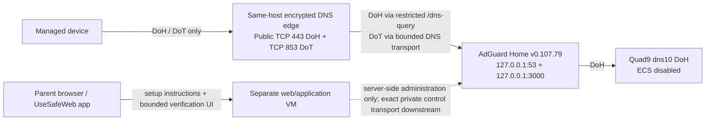

# TSK-0411 — DNS Service Topology and Client Configuration Model

**Version:** 1.0.0
**Date:** 2026-09-01
**Lifecycle:** L5 — Architecture, Technical Design & Delivery Readiness
**Task:** TSK-0411 — Design DNS service topology and client configuration model
**Acceptance:** ACC-0411 / VER-0411 / EVD-0411
**Authority:** current WBS; DEC-0016; DEC-0053/CR-0006; DEC-0054/CR-0007; DEC-0055/CR-0008
**Dependency:** TSK-0235 current PASS; LG-06 current PASS
**Primary DNS identity source:** `TSK_0408_POST_CR0007_REVALIDATION_EVIDENCE_2026-09-01.md`, blob `a6b41ff7462dab630aad9e7640950b0d3467f040`
**Architecture source:** `TSK_0235_SYSTEM_CONTEXT_CONTAINER_INTEGRATION_DIAGRAMS_2026-09-01.md`, blob `ecac82c1e020977a50af1d02345091415afba4ce`
**Privacy/config source:** `infrastructure/adguard-server/tsk-0413-bundle-v1/`, version `1.0.0`; README blob `5a162a87dd2761ff5a0da587fa660549309a1404`; public-fragment blob `867ef7162c739106fa42af151cda145f6d16888e`; endpoints blob `fe1d1b2d5cff13f85eda96a28f90a40921ef4506`

## 1. Decision

Freeze one coherent public DNS service identity and one lean initial DNS topology:

- customer service identity: **UseSafeWeb DNS**;
- canonical resolver hostname: **`dns.usesafeweb.com`**;
- public DoH URL: **`https://dns.usesafeweb.com/dns-query`**;
- Android Private DNS / DoT hostname: **`dns.usesafeweb.com`**;
- initial child-linked DNS service location: **Azure West Europe / Netherlands** on the owner-provided dedicated DNS VM;
- AdGuard Home remains the filtering/policy layer;
- upstream remains exactly **`https://dns10.quad9.net/dns-query`**, with ECS disabled;
- the web/application VM is not in the ordinary DNS data plane;
- no US DNS node or US-routed initial child-linked service path is authorised by this design.

The service is accountless-capable. DNS transport does not require a parent account, Firebase session, dashboard record, payment state, or browser identity. Optional account/device ownership may later control bounded server-side management operations, but it never becomes a prerequisite for ordinary DNS resolution and never proves protection.

## 2. TSK-0413 privacy-first invariants

The topology consumes the approved TSK-0413 desired state without weakening it:

- AdGuard Home `v0.107.79`, schema `34`;
- upstream exactly `https://dns10.quad9.net/dns-query`;
- ECS off;
- persistent query logging off;
- file query logging off;
- exceptional diagnostic query logging is outside the normal topology, requires separate authority, is capped at 24 hours, and must be deleted after use;
- anonymized aggregate operational statistics only, 24-hour retention;
- identifiable per-client statistics/history excluded;
- client-IP anonymization on;
- official AdGuard DNS filter is the single initial active filter;
- initial allowlist empty; later exceptions governed and versioned;
- AdGuard DNS listener binds only to `127.0.0.1:53`;
- AdGuard administration binds only to authenticated `127.0.0.1:3000`;
- AdGuard internal TLS listener remains disabled under the current TSK-0413 bundle;
- browser/customer code never receives an AdGuard administrative credential or arbitrary `/control/*` route;
- no browsing/query/activity-history product path exists.

## 3. Initial service topology

### Public exposure

| Surface | Initial exposure | Rule |
|---|---|---|
| TCP 443 | Public | Serve only the intended public HTTPS surface; DNS forwarding is restricted to the exact DoH path `/dns-query`. No AdGuard dashboard or arbitrary control path is proxied. |
| TCP 853 | Public | DoT for the exact hostname `dns.usesafeweb.com`; TLS/SNI identity must be valid. |
| UDP 53 | **Not public** | AdGuard plain DNS remains loopback-only. |
| TCP 53 | **Not public** | AdGuard plain DNS remains loopback-only. |
| TCP 3000 | **Not public** | AdGuard administration remains authenticated and loopback-only. |
| Other DNS transports | Not enabled by this task | DoQ/DNSCrypt/alternate endpoints require separate current authority and evidence. |

The same-host encrypted-DNS edge is a **transport/security boundary**, not a second customer DNS product. It may be implemented by the smallest auditable proxy/terminator that can satisfy this contract. Exact package/product configuration belongs to downstream implementation and must not change the service identity or TSK-0413 desired state silently.

## 4. DoH path

### 4.1 Request path

`client -> TLS 443 dns.usesafeweb.com -> exact /dns-query route -> loopback AdGuard DoH handler -> Quad9 dns10 DoH`

Requirements:

1. The edge accepts only the intended DoH route for DNS forwarding; `/control/*`, AdGuard UI routes, and arbitrary path forwarding are prohibited.
2. The edge strips/unsets untrusted client-supplied forwarding headers before setting its own verified client-address header.
3. The reverse proxy itself originates from the same-host loopback trust boundary. AdGuard's effective trusted-proxy configuration must be verified against the pinned AdGuard version before activation; no broad Internet CIDR is trusted as a proxy.
4. Host/SNI is restricted to `dns.usesafeweb.com` for the DNS service identity.
5. Request-body, connection, timeout, and rate controls are bounded so malformed/oversized/slow requests cannot consume unbounded resources.
6. Normal DoH requests are not application telemetry and do not flow through the web/application VM.

Current AdGuard Home guidance explicitly supports DoH behind a reverse proxy and uses trusted-proxy handling for real client-address headers. That mechanism is **DoH/HTTP-specific** in this design and is not assumed to solve DoT client identity.

## 5. DoT path

### 5.1 Request path

`client -> TLS 853 dns.usesafeweb.com -> same-host DoT edge -> loopback DNS transport -> AdGuard -> Quad9 dns10 DoH`

Android Private DNS uses the hostname, not the DoH URL/path.

### 5.2 Client-address and abuse-control constraint

The current TSK-0413 AdGuard listener is loopback-only and AdGuard internal TLS is disabled. A generic TLS terminator forwarding DoT to loopback can therefore collapse downstream source identity to the proxy address. **Do not claim HTTP `X-Forwarded-For`/trusted-proxy behavior applies to DoT.**

Before DoT production activation, the selected same-host edge must prove one of the following safe outcomes:

- external client source identity is preserved to the rate-control point through a version-supported mechanism; **or**
- the DoT edge itself enforces per-client plus global connection/query limits before loopback forwarding, while a multi-client load test proves the fixed downstream AdGuard limiter does not cause unacceptable cross-client starvation.

If neither can be proven with the pinned implementation, DoT activation is **BLOCKED for that implementation** and the integration must be redesigned. The correct response is not to expose public plain DNS, disable abuse controls, broaden logging, or enable an unapproved alternate backend.

This is a downstream implementation/verification condition, not a change to the TSK-0413 desired-state bundle.

## 6. Open-resolver and amplification-abuse controls

UseSafeWeb DNS must be reachable without product authentication, so the encrypted service is intentionally publicly reachable. “Prevent open-resolver abuse as far as practical” therefore means minimizing exploitable exposure and resource amplification rather than pretending the public accountless resolver is access-controlled.

### Frozen AdGuard controls from TSK-0413

- `ratelimit: 20`;
- IPv4 rate-limit subnet `/24`;
- IPv6 rate-limit subnet `/56`;
- rate-limit whitelist empty;
- `refuse_any: true`;
- plain DNS binds only to `127.0.0.1`;
- query logging/file logging off;
- anonymized operational statistics only.

### Edge controls required by this topology

1. Public ingress is TCP/TLS only on 443/853; no public UDP 53 reflection surface is created.
2. DoH path allowlisting prevents the TLS endpoint from becoming an AdGuard admin/UI proxy.
3. Per-client and global connection/request controls exist at the encrypted edge, with bounded bursts/timeouts/request sizes.
4. DoH client IP is accepted only from the trusted same-host proxy boundary; spoofed external forwarding headers are discarded.
5. DoT controls are applied at the edge until downstream source-identity semantics are proven, as specified in Section 5.2.
6. Rate-limit drops, saturation, CPU/memory/connection pressure, TLS errors, and aggregate availability are operational signals; **queried domains are not**.
7. No account/device ClientID is required merely to obtain DNS protection, and ClientID is never treated as an authentication secret.
8. Any future bypass list or rate-limit whitelist requires separate documented justification; the current whitelist is empty.

AdGuard Home's current configuration documentation identifies `ratelimit` and `refuse_any` as anti-DNS-amplification/DDoS controls. This design relies on those existing controls plus the encrypted edge; it does not infer that a public DNS service can be made abuse-proof.

## 7. Upstream model

The only approved resolver upstream is:

`https://dns10.quad9.net/dns-query`

Rules:

- no `dns11`/`dns12` ECS endpoint substitution;
- ECS remains disabled in AdGuard;
- bootstrap addresses remain the current TSK-0413 `9.9.9.10`, `149.112.112.10`, `2620:fe::10`, and `2620:fe::fe:10` values;
- no fallback upstream is configured by the current bundle;
- upstream failure becomes a truthful DNS-service degradation/failure state, not a silent fallback to an unapproved resolver.

Current Quad9 documentation identifies `dns10.quad9.net` / `https://dns10.quad9.net/dns-query` as its no-threat-blocking privacy-first service, while `dns11`/`dns12` are the ECS variants. Quad9 also documents `proto.on.quad9.net` as a controlled protocol test that can report `doh` when the query reached Quad9 by DoH.

## 8. Client configuration model

### 8.1 Android native Private DNS

- input type: hostname;
- value: `dns.usesafeweb.com`;
- transport: DoT;
- HTTPS URL/path is **not** pasted into the Private DNS hostname field;
- TLS identity must validate for the hostname;
- failure/bypass behavior must be represented truthfully by the current platform-specific guidance; this task does not invent UI-version-specific instructions.

### 8.2 Apple/iOS DNS Settings profile

- input type: DNS Settings configuration profile;
- transport: DoH;
- Server URL: `https://dns.usesafeweb.com/dns-query`;
- profile presence alone is not proof that current DNS traffic is protected;
- profile generation/signing/distribution implementation remains downstream, but the endpoint identity may not change silently.

### 8.3 Other clients/platforms

No generic “paste this FQDN everywhere” workflow is authorized. A later supported platform must bind the correct protocol/input form to the same canonical service identity and pass its own current platform verification before public instructions are published.

## 9. Verification model

Verification is split deliberately so no weak signal is mislabeled as protection.

### V1 — configuration identity

Confirm the platform contains the exact approved hostname/profile/DoH URL for its mechanism. This proves configuration intent only.

**Does not prove:** DNS traffic currently traverses UseSafeWeb.

### V2 — service endpoint health

Controlled synthetic checks verify:

- TLS/SNI/certificate validity for `dns.usesafeweb.com` on the supported encrypted transport;
- DoH `/dns-query` or DoT protocol response as applicable;
- no public AdGuard admin/control path;
- no public UDP/TCP 53 listener;
- current bundle/config identity and privacy controls.

**Does not prove:** a particular managed device is currently using the service.

### V3 — upstream transport/configuration

Controlled synthetic service checks verify the exact `dns10` upstream, ECS-off configuration and—where the target test path supports it—the Quad9 protocol marker returning DoH. This is synthetic infrastructure evidence and is never user browsing history.

### V4 — device-path technical verification

A managed device may be labeled technical **Verified** only when a current controlled device/network test proves that the active DNS path is UseSafeWeb under that platform's supported mechanism.

The exact synthetic device-path marker/mechanism is **not invented by TSK-0411** because the current TSK-0413 bundle has no approved custom verification rewrite and normal query logging is prohibited. Downstream implementation/testing must version a privacy-safe synthetic verification mechanism or another deterministic platform proof before the product can emit `Verified` from device-path evidence.

Until that exists/passes:

- endpoint reachability = **Reachable**, not Verified;
- profile/hostname presence = **Configured**, not Verified;
- parent confirmation = **Reported**, not Verified;
- account/device ownership = **Owned/registered**, not Verified;
- contradictory/missing technical evidence = **Uncertain / action needed**, not Verified.

No verification mechanism may require retaining ordinary queried domains, visited-site history, raw DNS query logs, stable cross-session accountless tracking, or per-client history.

## 10. Removal and recovery model

Removal is platform-specific and reverses only the platform configuration it owns.

### Android

Remove/replace the UseSafeWeb Private DNS hostname using the current supported Android mechanism, returning the device to the user's intended normal DNS mode. After removal, the product must stop claiming UseSafeWeb DNS protection unless later reconfigured and technically reverified.

### Apple/iOS

Remove/disable the UseSafeWeb DNS Settings profile through the supported profile-removal mechanism. Profile deletion does not delete an optional parent account or server-side device record automatically; those are distinct lifecycle operations.

### Truth rules

- DNS/profile removal is distinct from account deletion, dashboard device-record deletion, session logout, and AdGuard server-side resource reconciliation.
- A server/account record cannot prove that the physical device still uses UseSafeWeb DNS.
- After removal, any cached/stale UI status must degrade to removed/unverified until a new current technical verification succeeds.
- Recovery/reconfiguration reuses the same canonical service identity and current platform-specific mechanism; it does not silently fall back to plaintext DNS.

## 11. Region and expansion model

### Initial region

The initial child-linked DNS path remains **Azure West Europe / Netherlands**. The dedicated DNS VM is separate from the web/application VM. This task does not create or configure Azure control-plane resources.

### US boundary

No US DNS node is part of the initial path, and this design does not authorize a US market activation or US-region child-linked resolver. A user temporarily located elsewhere may still reach the West-Europe service; that does not authorize a separate US deployment.

### Expansion triggers

A new DNS region/topology review may be triggered by one or more of:

- owner approval of a named official market/region activation;
- sustained measured latency that materially harms supported setup/reliability;
- capacity/headroom or rate-limit-drop evidence showing the single-node topology is insufficient;
- recurring saturation/abuse patterns that cannot be contained proportionally at the existing edge;
- recovery/RTO evidence showing the topology cannot meet current accepted requirements;
- current privacy/legal/data-location/vendor constraints requiring a different region;
- a verified critical AdGuard/transport incompatibility.

Expansion does **not** automatically authorize a new customer hostname, ECS, query logging, per-client history, unapproved upstream, or different filtering baseline. The default is configuration parity with the current TSK-0413 bundle and one public identity `dns.usesafeweb.com`. Any material exception requires its owning change authority.

## 12. INT-0013 — DNS capability to user experience contract

The user-facing layer receives only a bounded technical contract:

| Technical state | UX may say | UX must not say |
|---|---|---|
| Approved config present only | Configured / setup applied | Verified / protected now |
| Endpoint synthetic health passes | Service reachable/healthy | This device is protected |
| Current device-path proof passes | Verified for the proven platform/path/time | Forever protected / all networks guaranteed |
| Verification unavailable/contradictory | Uncertain / check setup / retry | Protected based on account/profile presence |
| Removal proven | Removed / not currently verified | Account/device deletion also completed |
| Known platform/network bypass/limitation | Explicit limitation and recovery step | Universal unsupported guarantee |

Platform-specific instructions, states, errors, removal and recovery must match tested technical behavior. Producer changes to the DNS topology/endpoint/mechanism require consumer-impact review and affected UX/content regression under INT-0013.

## 13. RSK-0004 disposition

`RSK-0004` remains **OPEN — unvalidated**. TSK-0411 does not fabricate the later 14/30/90-day real-user persistence evidence.

Architecture controls that reduce the risk now:

- one canonical service identity rather than environment-specific user endpoints;
- encrypted transports only;
- deterministic configuration and truth-state separation;
- no silent upstream fallback;
- removal/recovery explicitly modeled;
- technical verification cannot be inferred from account/profile presence;
- region/capacity/abuse expansion triggers are explicit;
- privacy-first operational signals can detect service failure without browsing surveillance.

Later live-production persistence evidence may contradict this design and reopen the relevant architecture/UX work.

## 14. ACC-0411 trace

| ACC-0411 element | Evidence in this design | Result |
|---|---|---|
| DoH requirements | Exact HTTPS endpoint, TLS edge, `/dns-query` restriction, reverse-proxy trust boundary | SATISFIED |
| Privacy requirements | Exact TSK-0413 no-history/ECS-off/anonymization/24h aggregate-stat boundary | SATISFIED |
| Prevent open-resolver abuse as far as practical | No public port 53/admin; rate-limit/refuse-ANY; encrypted-edge per-client/global controls; DoT source-identity caveat fail-closed | SATISFIED AT DESIGN BOUNDARY |
| Verification | V1-V4 layered truth model; no false Verified state; privacy-safe synthetic proof required | SATISFIED AT DESIGN BOUNDARY |
| Removal | Android/Apple removal/recovery truth model and separation from account/device lifecycle | SATISFIED |
| Azure West Europe | Initial child-linked DNS node fixed to West Europe/Netherlands | SATISFIED |
| Later expansion triggers | Named-market, latency, capacity, abuse, recovery, legal/privacy and incompatibility triggers defined | SATISFIED |
| Avoid unapproved US initial traffic/node | No US DNS node or US-region initial resolver authorized | SATISFIED |
| REQ-0042 / CON-0002 | AdGuard remains filtering/policy layer absent verified critical blocker | SATISFIED |
| REQ-0043 | Exact Quad9 dns10 upstream; ECS endpoints prohibited | SATISFIED |
| CON-0003 | Public client path uses encrypted DoH/DoT only | SATISFIED |
| INT-0013 | Supported mechanisms/limits/errors/removal/recovery map to bounded UX truth states | SATISFIED AT DESIGN BOUNDARY |

## 15. Current external-source review

Checked 2026-09-01 against current official sources:

- AdGuard Home Encryption: https://github.com/AdguardTeam/AdGuardHome/wiki/Encryption
- AdGuard Home Configuration: https://github.com/AdguardTeam/AdGuardHome/wiki/Configuration
- Quad9 Services: https://docs.quad9.net/services/
- Quad9 FAQ / protocol verification: https://docs.quad9.net/FAQs/

Current AdGuard documentation supports DoH reverse-proxy operation with an explicit trusted-proxy boundary and documents `ratelimit`/`refuse_any` as anti-amplification controls. Current Quad9 documentation confirms `dns10.quad9.net` / `https://dns10.quad9.net/dns-query` as the non-ECS no-threat-blocking service and distinguishes the `dns11`/`dns12` ECS variants. The Quad9 protocol test can confirm upstream DoH for a controlled synthetic query.

These current technical sources validate the design mechanics only. They do not create production observation, user evidence, market activation, or a new owner decision.

## 16. Deferred implementation facts and non-inference

TSK-0411 deliberately does **not** select or claim:

- the exact encrypted-edge package/version/configuration;
- an implemented DoT source-preservation mechanism;
- a custom device-path verification hostname/rewrite/token;
- public DNS/firewall/TLS rules already deployed;
- a live Azure West-Europe service observation;
- a US deployment or market activation;
- multi-region routing/anycast/GeoDNS;
- production capacity or persistence evidence;
- AdGuard admin/API exposure to browser/customer code.

Those facts require their downstream implementation/test/operations authority and evidence.

**No implementation, live DNS activation, LG-07/LG-08, production deployment, market activation, launch, or real-user persistence PASS is inferred by this design.**

## 17. Review record

- Review date: 2026-09-01.
- Responsible verifier/reviewer: ChatGPT Project Governor under A3 / AUTO_ALLOWED, subject to independent deterministic GitHub acceptance before runtime PASS.
- Exact evidence environment/source: canonical GitHub `main`; current WBS/registers; current TSK-0408/TSK-0235/TSK-0413 artifacts; current official AdGuard Home and Quad9 documentation above.
- Deviations/disposition: DoT client-address preservation through an external TLS terminator is not assumed. The implementation must prove safe source-aware or equivalent edge controls and multi-client behavior before activation. Device-path synthetic verification is also not invented; the product cannot emit technical `Verified` until a privacy-safe deterministic mechanism is implemented and tested.
